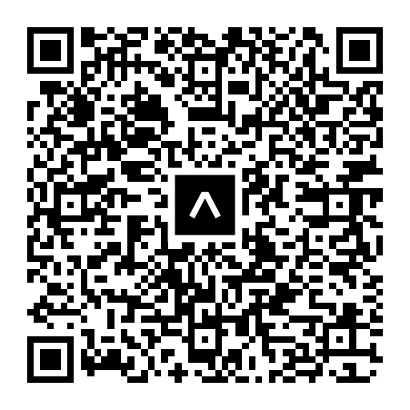

# Bond Studio Test 👋

## Get started (Local development)

1. First clone the repo

   ```bash
   git clone git@github.com:engineerStuardo/bondStudioTest.git
   ```

2. Install dependencies

   ```bash
   npm install
   ```

3. Start the app

   ```bash
    npx expo start
   ```

## Get started (Running app on Expo Go)

1. First install Expo Go app on your phone.
2. Scan the QA code below and enjoy the beautiful app.


